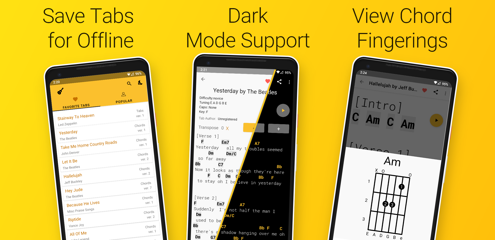

An [open source](https://github.com/cullub/Tabs-Lite) guitar tablature application built for Android.  Over a million songs available using an existing popular tabs database. Built for speed and simplicity, 100% free with no ads!

## Download

Our main download site is directly from Google Play here:

## About

Find your favorites out of over a million available chords and tabs! Play along at your own speed with built-in auto scroll and speed adjustment, and save to your favorites to enable offline access.

Tabs Lite supports three Dark Mode options:
 - System Mode (Default)
 - Force Dark Mode
 - Force Light Mode
 
 System mode automatically follows the dark mode setting of your device, Android 9.0+.  On earlier versions, it behaves the same as Force Light Mode.  (Developer's note: if you have experience with color schemes, [maybe you can help improve ours](https://github.com/cullub/Tabs-Lite/issues/48)!)

Tap the heart on the top of any tab to add it to your favorites.  This enables offline access for this tab, and pins it to your home page for easy access.  You can sort your favorite tabs by date added, name, artist, or popularity.

Quickly find the content you're looking for with a beautiful Material Design built for speed and simplicity. Search hundereds of thousands of available songs by title or author name, 100% free with no ads!  This app wasn't built to make a profit; instead, all the time spent on development was donated with the goal of making a good app.  This app is significantly faster than its competition, and provides as many or more songs than any other app on the market.

If you want to play a song in a different key, you're in luck!  Key changes are as simple as a touch of a button with built in transposition. Or find the fingering for any chord by simply tapping the chord name!  When you click the share button, your current key is saved and sent along too!

## iOS Support

We don't support iOS at this time, and don't have any plans to in the future.  However, the share link is designed to fall back to a web app should the native app not be installed, so feel free to share with your friends on iOS anyway.  If you know an iOS dev that would like to work on this, have them get in touch!
